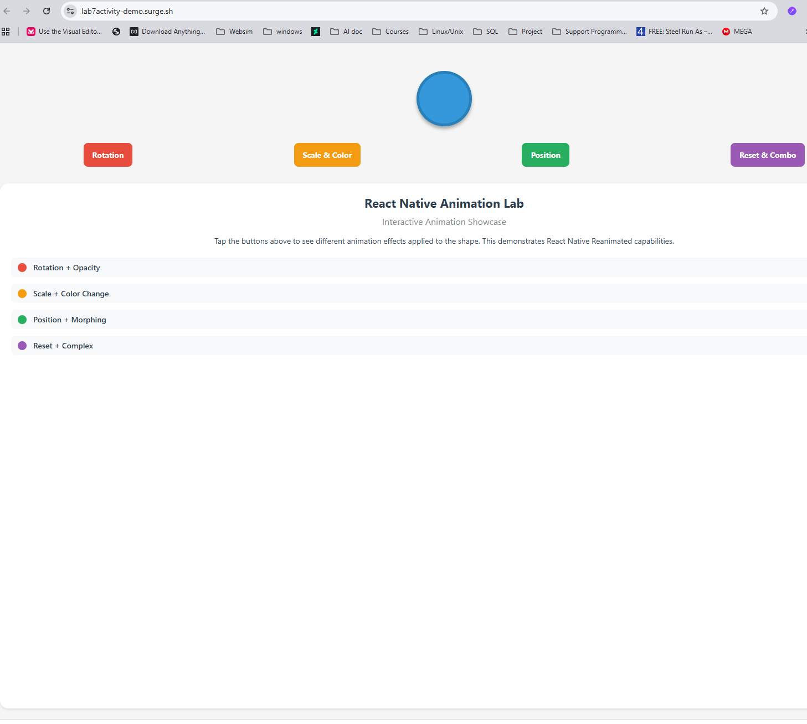
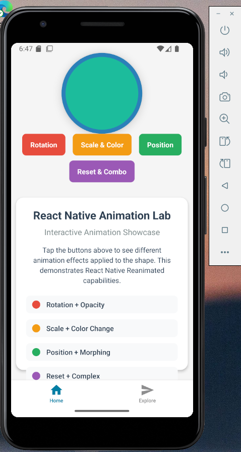

## Lab7Activity – React Native Animations with Reanimated

- Course: Cross Platform Mobile Development
- Author: Harry Joseph
- Created: November 11, 2025
- Platform: Expo (React Native + TypeScript + Expo Router)
- Package Manager: npm
- Minimum React Native version (from scaffold): 0.81.x
- Routing: File‑based via `expo-router`
- Animation Library: React Native Reanimated v4.1.1

## Overview
Lab7Activity demonstrates advanced React Native animations using React Native Reanimated. The project showcases interactive button-controlled animations including rotation, scaling, color changes, and morphing effects with spring physics and smooth transitions.

## Quick Download

**Get the complete project instantly:**

[](https://github.com/hjoseph777/Lab7Activity/releases/download/v1.0/Lab7Activity.zip)

[](https://lab7activity-demo.surge.sh)

## Platform Showcase

<div align="left">
  <table>
    <tr>
      <td align="left" width="50%">
        <a href="assets/images/WEB.png" target="_blank">
          
        </a>
        <br>
        <strong>🌐 Web Platform</strong>
        <br>
        <em>Cross-browser compatibility</em>
        <br>
        <em style="font-size: 12px; color: #666;">💡 Click image to view full size</em>
        <br>
        <a href="https://lab7activity-demo.surge.sh" target="_blank">
          
        </a>
      </td>
      <td align="left" width="50%">
        <a href="assets/images/Mobile.png" target="_blank">
          
        </a>
        <br>
        <strong>📱 Mobile Platform</strong>
        <br>
        <em>iOS & Android native performance</em>
        <br>
        <em style="font-size: 12px; color: #666;">💡 Click image to view full size</em>
        <br>
        <a href="https://expo.dev/accounts/hjoseph777/projects/Lab7Activity" target="_blank">
          
        </a>
      </td>
    </tr>
  </table>
</div>

*Ready-to-run React Native Reanimated project with interactive animations*

## Quick Start

**Clone and run the project:**

```bash
git clone [your-repo-url]
cd Lab7Activity
npm install
npx expo start
```

*Complete Expo project with React Native Reanimated animations ready to run*

## Important: Where your animation code lives
- The main animation demo is in [`app/(tabs)/index.tsx`](app/(tabs)/index.tsx) with 4-button animation controls and animated shape
- The animation examples component is in [`components/AnimatedApp.tsx`](components/AnimatedApp.tsx) with reusable animation patterns
- Animation documentation is in [`app/(tabs)/explore.tsx`](app/(tabs)/explore.tsx) explaining each animation technique

## Project Explorer
An interactive, collapsible view of the codebase. Click file names to open them.

<details open>
   <summary><strong>app/ – Routes & Navigation</strong></summary>

   - 📁 <strong>app</strong>
      - 📄 [`_layout.tsx`](app/_layout.tsx) – Root stack layout with theme provider
      - 📄 [`modal.tsx`](app/modal.tsx) – Example modal screen
      - 📁 <strong>(tabs)</strong>
         - 📄 [`_layout.tsx`](app/(tabs)/_layout.tsx) – Bottom tab navigator config
         - 🏠 [`index.tsx`](app/(tabs)/index.tsx) – **Main animation demo screen with 4 interactive buttons**
         - 🔍 [`explore.tsx`](app/(tabs)/explore.tsx) – Animation techniques documentation
</details>

<details>
   <summary><strong>components/ – Animation Components</strong></summary>

   - 📁 <strong>components</strong>
      - 🎬 [`AnimatedApp.tsx`](components/AnimatedApp.tsx) – **Reusable animation examples component**
      - 🖼️ [`parallax-scroll-view.tsx`](components/parallax-scroll-view.tsx) – Parallax header wrapper
      - ✨ [`themed-text.tsx`](components/themed-text.tsx) – Theme aware text
      - 🎨 [`themed-view.tsx`](components/themed-view.tsx) – Theme aware container
      - 🔔 [`haptic-tab.tsx`](components/haptic-tab.tsx) – Haptic feedback for tabs
      - 🔗 [`external-link.tsx`](components/external-link.tsx) – External URL opener
      - 👋 [`hello-wave.tsx`](components/hello-wave.tsx) – Animated wave component
      - 📁 ui
         - 📂 [`collapsible.tsx`](components/ui/collapsible.tsx) – Expand/collapse content region
         - 🧩 [`icon-symbol.tsx`](components/ui/icon-symbol.tsx) – Generic platform icon
         - 🧩 [`icon-symbol.ios.tsx`](components/ui/icon-symbol.ios.tsx) – iOS variant icon
</details>

<details>
   <summary><strong>constants/ & hooks/ – Theming & Utilities</strong></summary>

   - 🎛️ [`constants/theme.ts`](constants/theme.ts) – Theme tokens & palette
   - 🧵 Hooks:
      - [`hooks/use-color-scheme.ts`](hooks/use-color-scheme.ts) – Native color scheme
      - [`hooks/use-color-scheme.web.ts`](hooks/use-color-scheme.web.ts) – Web override
      - [`hooks/use-theme-color.ts`](hooks/use-theme-color.ts) – Resolve themed colors
</details>

<details>
   <summary><strong>Assets & Scripts</strong></summary>

   - 🖼️ `assets/images/` – Icons, splash, logos
   - 🛠️ [`scripts/reset-project.js`](scripts/reset-project.js) – Reset scaffold helper
</details>

<details>
   <summary><strong>Config & Meta</strong></summary>

   - ⚙️ [`app.json`](app.json) – Expo configuration (name, icons, splash)
   - 📦 [`package.json`](package.json) – Dependencies & scripts
   - 🧪 [`tsconfig.json`](tsconfig.json) – TypeScript compiler options
   - 🔍 [`eslint.config.js`](eslint.config.js) – Lint rules
   - 📝 [`README.md`](README.md) – Documentation (this file)
   - 📄 [`Example.md`](Example.md) – Template reference
</details>

## Animation Features

### Interactive Button Controls
The app features 4 interactive buttons that trigger different animation effects:

1. **🔄 Rotate** - Smooth 360-degree rotation with spring physics
2. **📏 Scale & Color** - Dynamic scaling with color transitions
3. **📍 Move & Morph** - Position changes with shape morphing
4. **⚡ Complex** - Sequential choreographed animation effects

---

*This project demonstrates modern React Native animation techniques using React Native Reanimated with cross-platform compatibility in mind.*
